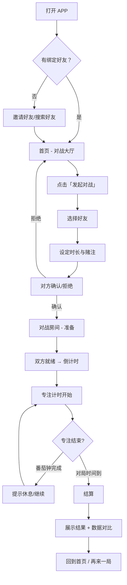

# 卷王对决 — 双人学习对战平台 · 产品需求文档

> 版本：v1.0 | 日期：2026-06-18 | 状态：草案

---

## 目录

1. [产品概述](#1-产品概述)
2. [目标用户与场景](#2-目标用户与场景)
3. [核心玩法机制](#3-核心玩法机制)
4. [功能清单与迭代路线](#4-功能清单与迭代路线)
5. [页面与交互流程](#5-页面与交互流程)
6. [游戏化系统](#6-游戏化系统)
7. [数据指标](#7-数据指标)
8. [商业模式](#8-商业模式)
9. [技术架构建议](#9-技术架构建议)

---

## 1. 产品概述

### 1.1 一句话定位

> **把「专注学习」变成双人对战的武器——和好友互相监督、彼此刺激，让卷变得好玩。**

### 1.2 核心价值

| 用户痛点 | 解决方案 |
|---------|---------|
| 一个人学不下去，缺乏监督 | 双人绑定，互相监督，逃不掉 |
| 番茄钟枯燥，难以坚持 | 学习=对战，即时反馈+胜负欲驱动 |
| 学习成果不可见 | 数据可视化 + 段位晋级 + 赛季结算 |
| 想卷但缺少竞争氛围 | 排行榜、段位、成就体系制造竞争场 |

### 1.3 差异化定位

```
        答题对战型               专注对战型（我们）
        ──────────              ──────────────
  LearnClash / CRAMMIT          卷王对决
        │                            │
  测试已有知识                   比拼学习毅力
  门槛高（需要会）              门槛低（只要学）
  适合复习阶段                  适合日常自律
```

对比 Focus Town（最接近的竞品）：

| 维度 | Focus Town | 卷王对决 |
|------|-----------|---------|
| 核心机制 | 自习Online + 陪伴感 | 双人对战 + 胜负欲 |
| 社交关系 | 陌生人自习室 | **好友绑定对战** |
| 游戏化驱动 | 收集+装修 | **竞争+段位+赛季** |
| 盈利模式 | 订阅 + 虚拟币 | 订阅 + 皮肤 + 道具 |
| 目标市场 | 泛自习人群 | **想卷的学生/职场人** |

---

## 2. 目标用户与场景

### 2.1 用户画像

**Primary Persona —— 卷王小明**

- 大二学生，目标考研/考公
- 每天需要5-8小时专注学习
- 已经用 Forest/Focus Town，但觉得一个人学没劲
- 有一个同样在备考的好友，两人经常互相监督
- 愿意为提效工具付费（月均 20-50 元）

**Secondary Persona —— 自律小白小红**

- 职场新人，想下班后学习但管不住自己
- 需要外部压力驱动
- 被朋友拉入 APP，"有人陪我卷"

### 2.2 典型场景

1. **日常对战**：小明和小红约定今晚一起学2小时，打开 APP 发起对战，各自学自己的，结束后看谁更专注
2. **赛季冲刺**：新赛季开始，小明想冲黄金段位，每天坚持完成对战任务
3. **好友邀请**：小红觉得自己学不下去，发邀请链接给小明，拉他入局
4. **查看周报**：周日收到上周对战报告，发现自己胜率60%，很有成就感

---

## 3. 核心玩法机制

### 3.1 核心循环

```
发起对战 ←→ 各自专注学习 ←→ 结算胜负
    ↑                            │
    └──────── 循环挑战 ──────────┘
```

### 3.2 详细对战规则

#### 对战流程

```
1. 发起方设定：
   - 对战时长（25min / 45min / 90min / 自定义）
   - 赌注（可选：积分 / 徽章 / 虚拟币）
   
2. 对方确认 → 倒计时 3-2-1 → 进入专注状态

3. 专注过程中：
   - 双方进入「专注模式」，手机锁屏/白名单
   - 实时显示对方的专注状态（学习中 / 休息中 / 已中断）
   - 每次完成一个番茄钟 = 发动一次「攻击」
   - 中断/提前退出 = 受到「伤害」

4. 结算（对局结束时）：
   - 胜者：专注时长更长 / 完成番茄钟更多的一方
   - MVP 结算动画展示双方数据对比
   - 加减段位积分（ELO 算法）
   - 更新对战记录
```

#### 核心公式

```
专注得分 = Σ(每个番茄钟时长 × 完成度系数)
完成度系数：
  - 完整完成番茄钟 ×1.0
  - 提前结束 ×0.3
  - 中断未恢复 ×0

伤害值 = 当前专注得分 × 0.1（即每次完成番茄钟发动一次攻击）
血量上限 = 100
```

#### 特殊机制

| 机制 | 描述 |
|------|------|
| **连击 Combo** | 连续完成3个番茄钟 → 攻击力 ×1.5 |
| **逆转翻盘** | 最后5分钟专注速度提升为2倍 |
| **防摸鱼检测** | 手机加速度传感器检测是否在玩手机（基础版） |
| **双倍周末** | 周末对战积分 ×2 |
| **复仇战** | 输掉后立即发起复仇 → 赢了不扣分 / 输了双倍扣分 |

### 3.3 对战模式

| 模式 | 说明 | 时长 | 解锁条件 |
|------|------|------|---------|
| **快速对决** | 单局制，比一个番茄钟的专注度 | 25min | 默认解锁 |
| **深潜模式** | 三局两胜，比三个番茄钟 | 90min | 等级3解锁 |
| **马拉松** | 整晚学习赛，比总时长 | 2-4h | 等级5解锁 |
| **主题赛季** | 按月赛季，累计胜场排名 | 30天 | 默认参与 |

---

## 4. 功能清单与迭代路线

### 4.1 MVP（4周开发）

**核心对战功能**

| 模块 | 功能 | 优先级 | 说明 |
|------|------|--------|------|
| 用户系统 | 手机号/微信登录 | P0 | |
| 用户系统 | 个人主页（头像、昵称、段位） | P0 | |
| 好友系统 | 通过 ID/链接添加好友 | P0 | |
| 好友系统 | 好友列表 | P1 | |
| 对战系统 | 发起对战（选时长+选好友） | P0 | 核心功能 |
| 对战系统 | 番茄钟计时器 | P0 | 专注计时核心 |
| 对战系统 | 专注状态同步（WebSocket） | P0 | 实时看到对方状态 |
| 对战系统 | 结算对战结果 | P0 | 胜/负/平 |
| 对战系统 | 段位积分变动 | P0 | ELO 算法 |
| 对战系统 | 对战记录 | P1 | 历史胜负 |

**基础学习工具**

| 模块 | 功能 | 优先级 | 说明 |
|------|------|--------|------|
| 番茄钟 | 专注/休息切换 | P0 | 25min 专注 + 5min 休息 |
| 番茄钟 | 自定义时长 | P1 | |
| 任务清单 | 今日学习任务（Todo） | P1 | 对局前设定今日目标 |
| 任务清单 | 任务完成打卡 | P1 | 学习完成后标记完成 |

### 4.2 V2（8周）

| 模块 | 功能 | 说明 |
|------|------|------|
| 游戏化 | 段位系统（铁→青铜→白银→黄金→铂金→钻石→大师→王者） | 8段位，每段3小阶 |
| 游戏化 | 成就系统（首胜、连击王、马拉松选手等） | 15-20个成就徽章 |
| 游戏化 | 赛季系统（月度赛季，结算奖励） | 赛季末重置段位 |
| 游戏化 | 排行榜（好友榜 / 全校榜 / 全国榜） | |
| 番茄钟 | 沉浸模式（白名单锁机） | 防摸鱼 |
| 番茄钟 | 专注数据统计（日/周/月报） | |
| 任务清单 | AI 任务拆分建议 | |
| 社交 | 对战房间留言/挑衅 | 战前放狠话 |

### 4.3 V3（12周）

| 模块 | 功能 | 说明 |
|------|------|------|
| 游戏化 | 虚拟形象 + 皮肤商城 | 基础形象免费，皮肤付费 |
| 游戏化 | 特效（连胜特效、段位晋级特效） | 视觉激励 |
| 游戏化 | 赌注系统（对赌虚拟币/徽章） | 输了要付出代价 |
| 社交 | 学习小队（3-5人轮换对战） | 群组功能 |
| 社交 | 观战模式 | 好友对战时可以围观 |
| 工具 | AI 学伴（学习复盘 + 建议） | |
| 工具 | 多平台同步（Web→App） | |
| 商业化 | Focus Pass 订阅 | 详见商业模式 |

---

## 5. 页面与交互流程

### 5.1 核心页面结构

```
首页（对战大厅）         对战房间            专注计时
┌──────────────┐   ┌──────────────┐   ┌──────────────┐
│  ☰ 卷王对决    │   │ ⚔️  vs  小明   │   │ ⏱ 12:34      │
│              │   │              │   │   ████████░░   │
│ ┌──────────┐ │   │ 专注目标: 25min│   │              │
│ │ 发起对战  │ │   │ 赌注: 10积分   │   │  学习中...    │
│ └──────────┘ │   │              │   │              │
│              │   │ 小明 ● 学习中   │   │ 小红的进度     │
│ 在线好友      │   │ 你   ● 准备中   │   │ ██████████    │
│ • 小明 ●     │   │              │   │              │
│ • 小红 ●     │   │ [开始专注]     │   │ [暂停] [结束]  │
│ • 小刚 ○     │   └──────────────┘   └──────────────┘
│              │
│ 段位: 白银III │         结算页面            个人主页
│ 本赛季: 8胜3负 │   ┌──────────────┐   ┌──────────────┐
│              │   │ 🏆 你赢了！     │   │ 🧑 卷王小明   │
│ [历史记录]    │   │              │   │              │
│ [排行榜]      │   │ 你    25min   │   │ ⚜️ 白银III     │
└──────────────┘   │ 小明  18min   │   │ ─────────    │
                   │              │   │ 总场次 47     │
                   │ +15 段位积分  │   │ 胜率  68%     │
                   │ 连击 x3 达成！│   │ 总专注 120h   │
                   │              │   │              │
                   │ [再来一局]     │   │ [对战记录]     │
                   │ [返回大厅]     │   │ [成就墙]       │
                   └──────────────┘   └──────────────┘
```

### 5.2 用户核心流程



---

## 6. 游戏化系统

### 6.1 段位系统

基于 ELO 算法的段位体系：

| 段位 | 段位分区间 | 小阶数 | 说明 |
|------|-----------|--------|------|
| 🥉 青铜 | 0-599 | 3 | 初始段位 |
| 🥈 白银 | 600-999 | 3 | 大多数用户停留段位 |
| 🥇 黄金 | 1000-1299 | 3 | 认真卷的用户 |
| 💎 铂金 | 1300-1599 | 3 | 前20% |
| 🏅 钻石 | 1600-1899 | 3 | 前5% |
| 👑 大师 | 1900-2199 | 2 | 前1% |
| 🏆 王者 | 2200+ | 1 | 前0.1% |

**ELO 参数**：
- K-factor：新用户（前10场）40，普通用户 20
- 匹配范围：±200 段位分
- 初始段位分：600（青铜III）

### 6.2 成就系统

| 成就 | 条件 | 奖励 |
|------|------|------|
| 初战告捷 | 完成第一场对战 | 头像框 |
| 三连胜 | 连续赢3场 | 50 积分 |
| 十连胜 | 连续赢10场 | 限定皮肤 |
| 马拉松选手 | 单次专注超4小时 | 徽章 |
| 早鸟 | 早上6-8点完成对战累计10次 | 徽章 |
| 夜猫子 | 晚上10-12点完成对战累计10次 | 徽章 |
| 全能王 | 3种对战模式各赢10场 | 限定称号 |
| 卷王之王 | 单赛季胜场最多 | 赛季限定皮肤 |

### 6.3 赛季系统

- 周期：**每月一个赛季**
- 赛季任务：每日/每周对战任务
- 赛季结算：基于最终段位发放奖励
- 段位重置：赛季结束后降2个大段位

### 6.4 双人特殊机制

| 机制 | 说明 |
|------|------|
| **连坐激励** | 两人都完成当日目标 → 额外积分加成 |
| **羁绊等级** | 和同一好友对战越多，羁绊等级越高 → 附加奖励递增 |
| **复仇标记** | 输的一方头上显示复仇标记，胜方被挑战时有额外负担 |

---

## 7. 数据指标

### 7.1 北极星指标

> **双人有效专注时长** = 所有成功完成对局的专注时间总和

### 7.2 核心指标

| 分类 | 指标 | 说明 |
|------|------|------|
| 活跃 | DAU / MAU | 日活/月活 |
| 活跃 | 日对战次数 / 用户 | 人均每日发起/参与对局数 |
| 专注 | 人均专注时长 | 单日/单场专注时间 |
| 留存 | 次日 / 7日 / 30日留存 | |
| 社交 | 好友绑定率 | 有绑定好友的用户占比 |
| 社交 | 好友对战复购率 | 和同一好友二次对战比例 |
| 付费 | 付费率 / ARPU | |

### 7.3 目标基准（参考行业）

| 指标 | 目标 |
|------|------|
| 次日留存 | ≥ 40% |
| 7日留存 | ≥ 25% |
| 30日留存 | ≥ 15% |
| 日人均对战次数 | ≥ 1.5 次 |
| 日人均专注时长 | ≥ 45 min |
| 好友绑定率 | ≥ 70% |

---

## 8. 商业模式

### 8.1 免费层

- ✓ 无限次快速对决
- ✓ 基础番茄钟
- ✓ 基础数据统计
- ✓ 好友绑定（最多5人）
- ✓ 基础段位（青铜-黄金）

### 8.2 Focus Pass 订阅

**定价：¥19.9/月 或 ¥129/年**

| 权益 | 免费 | Focus Pass |
|------|------|-----------|
| 好友数量上限 | 5人 | 无限 |
| 对战模式 | 快速对决 | 全部模式 |
| 历史数据 | 7天 | 全部 |
| 段位上限 | 黄金 | 王者 |
| 皮肤商城 | ❌ | ✓ |
| 专注报告 | 基础版 | AI 深度分析 |
| 锁机白名单 | ❌ | ✓ |
| 赛季奖励 | 基础 | 双倍 |

### 8.3 虚拟商店

| 商品 | 价格 | 说明 |
|------|------|------|
| 皮肤 - 限定款 | ¥6-12/件 | 段位晋级特效、头像框 |
| 表情包礼包 | ¥3-6 | 对战中的互动表情 |
| 双倍积分卡 | ¥1/张 | 下局对战积分双倍 |
| 免死金牌 | ¥2/张 | 输了不扣段位分 |

### 8.4 估算（假设 10 万 MAU）

| 收入来源 | 转化率 | 单价 | 月收入 |
|---------|-------|------|-------|
| Focus Pass | 5% × 10万 = 5000 | ¥19.9 | ¥99,500 |
| 虚拟商品 | 15% × 10万 = 15000 | ¥6 | ¥90,000 |
| 总计 | | | **≈ ¥19 万/月** |

---

## 9. 技术架构建议

### 9.1 技术栈选择

| 层级 | 技术 | 选型理由 |
|------|------|---------|
| 前端（Web） | React + TailwindCSS + TypeScript | 开发效率高，生态成熟 |
| 前端（App） | React Native（后续） | 代码复用 Web 端逻辑 |
| 实时通信 | WebSocket / Socket.IO | 专注状态同步 |
| 后端 | Node.js (Express/NestJS) or Go | 实时性好，Go 更适合高并发 |
| 数据库 | PostgreSQL（主）+ Redis（缓存/状态） | |
| 部署 | Vercel (Web) + AWS/Aliyun | |

### 9.2 MVP 技术架构

```
前端（React SPA）
    │
    ├── REST API（用户、对局、好友）─→ 后端（Node.js）─→ PostgreSQL
    │
    └── WebSocket（实时状态同步）────→ Socket.IO ──→ Redis
```

### 9.3 数据模型核心实体

```sql
-- 用户
users (id, nickname, avatar, phone, elo_rating, tier, created_at)

-- 好友关系
friendships (id, user_id, friend_id, bond_level, created_at)

-- 对局
battles (id, challenger_id, opponent_id, duration, bet, status, created_at)

-- 番茄钟记录
pomodoro_sessions (id, battle_id, user_id, duration, completed, started_at, ended_at)

-- 对局结果
battle_results (id, battle_id, winner_id, challenger_score, opponent_score, elo_change)
```

---

## 10. 路线图

```
Month 1         Month 2         Month 3         Month 4-6
──────────     ──────────      ──────────      ──────────
MVP 开发        V2 内测         公测上线         V3 迭代
• 核心对战      • 段位系统       • 全量开放       • 虚拟形象
• 番茄钟        • 成就系统       • 推广获客       • 皮肤商城
• 好友系统      • 赛季系统       • 付费上线       • 学习小队
• 基础UI        • 排行榜         • 数据优化       • AI 学伴
               • 沉浸模式                       • App 版本
```

---

## 附录：竞品对比矩阵

| 维度 | Focus Town | LearnClash | Duolingo | **卷王对决（我们）** |
|------|-----------|-----------|---------|-------------------|
| 核心机制 | 自习世界 | Quiz 对战 | 闯关学习 | **专注时长对战** |
| 对战 | ❌ 纯自习 | ✅ 1v1 Quiz | ❌ 排行榜 | **✅ 1v1 专注对战** |
| 番茄钟 | ✅ | ❌ | ❌ | **✅ 核心功能** |
| 游戏化 | 收集+装修 | ELO段位 | 闯关+段位 | **段位+成就+赛季** |
| 社交 | 陌生人 | 好友+匹配 | 好友排行榜 | **好友绑定对战** |
| AI | ❌ | ✅ 出题 | ✅ 课程 | **✅ 数据复盘** |
| 定价 | $6.99/月 | $7.99/月 | $6.99/月 | **¥19.9/月** |
